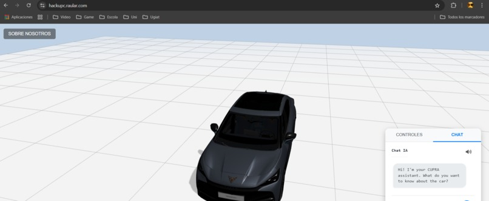
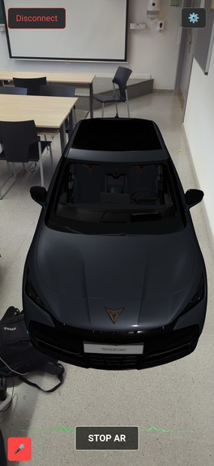
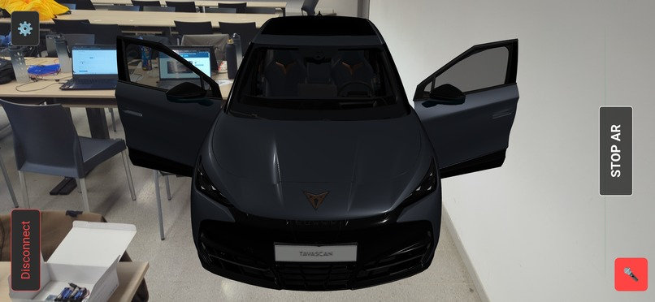
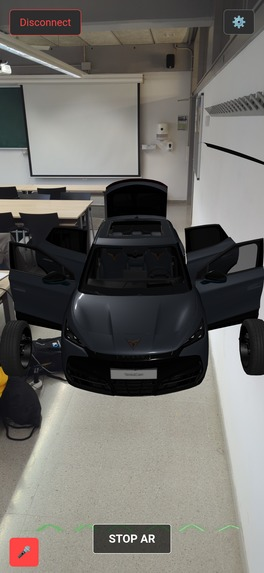
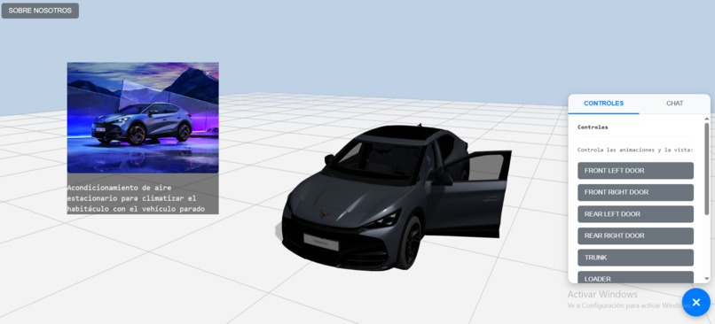

# 🚗 Know Your Cupra / TAVASCAN Rush – UPCHack2025 Project Submission
### Team Project for SEAT's Challenge at UPCHack2025

---

**🔗 Project Links:**

*   **Devpost Submission:** [https://devpost.com/software/cupraai](https://devpost.com/software/cupraai)
*   **Web Application (Use Google Chrome):** [https://hackupc.raular.com/](https://hackupc.raular.com/)
*   **AR Experience (Mobile):** [https://hackupc.raular.com/ar](https://hackupc.raular.com/ar)

---

## 🏁 Inspiration & Context

We believe in making learning easier and more engaging for everyone. New technologies like **live voice conversations with LLMs** and **Augmented Reality (AR)** offer powerful tools to simplify complex information. We were also inspired by the benefits of **digital twins** in the automotive sector and excited to apply this concept to enhance the **CUPRA customer experience**.

Specifically, learning about the numerous innovative features of a new car like the **Cupra TAVASCAN** can be challenging, often requiring buyers to read a dense manual (nearly 400 pages). Our project addresses the **gap between purchase and delivery**, transforming this waiting period into an interactive learning journey.

Our mission is to empower future owners by allowing them to explore, understand, and interact with their Tavascan's features **before they even receive the keys**, using an intuitive visual and audio approach.

---

## 🎯 Project Summary: What it Does

We developed **TAVASCAN Rush**, an interactive guide powered by voice and AR, designed to facilitate learning about the Cupra Tavascan's features. Users can:

-   Engage in **live voice conversations** with an AI guide about the car.
-   Receive **tutorials** where the system **highlights or animates relevant parts** of the car in real-time.
-   Explore features using **Augmented Reality (AR)** on compatible mobile devices.
-   Interact with a **3D model** on desktop or non-AR compatible devices.
-   Visualize information through **relevant images** retrieved directly from the manual.

This multi-modal (visual + audio) approach simplifies learning and ensures buyers are familiar and confident with their new car's capabilities from day one.

---

## 🧩 System Architecture & How We Built It

### 🤖 1. Conversational AI Assistant (Gemini Live)

-   Utilizes **Google Gemini Live API** for low-latency, natural voice conversations.
-   Employs **function calling** to trigger actions, access tools, and control the 3D/AR model during tutorials.
-   Integrates custom-made tutorials and connects to an **n8n webhook** for advanced agentic capabilities and RAG orchestration.

### 🧠 2. Manual Parsing & Knowledge Base (Python, PyMuPDF, Pinecone)

-   The official **Cupra TAVASCAN PDF manual** (~400 pages) was parsed using **Python** and **PyMuPDF** to extract text and images.
-   Extracted **images** were vectorized and stored in a **Pinecone** vector database.
-   This enables **Retrieval-Augmented Generation (RAG)** specifically for retrieving the most relevant manual images based on the user's query or the context of the tutorial.

### ⚙️ 3. Backend Integration & Orchestration (Laravel, n8n)

-   The core backend logic is built with **Laravel (PHP)**.
-   Laravel fuses the **interactive AR/3D visualization**, the **low-latency voice chat (Gemini Live)**, and the **function calling** capabilities.
-   It handles routing requests, calling Gemini functions, triggering actions on the frontend, and managing custom tutorials.
-   An **n8n workflow**, triggered via webhook from Laravel, assists with specific RAG processes and potentially other advanced automation tasks.

### 🚘 4. 3D Interactive Model (Three.js, Blender)

-   A high-fidelity 3D model of the Cupra TAVASCAN, likely refined using **Blender**.
-   Users can interact with the model (rotate, zoom).
-   Crucially, parts of the model can be **highlighted or animated** based on the AI assistant's explanations via function calls.
-   Built with **Three.js**, providing a web-based 3D experience accessible on desktops.

### 📱 5. Augmented Reality (AR) Experience (WebXR/AR.js)

-   Leverages web-based AR (**WebXR**, potentially using libraries like **AR.js**) for broad compatibility.
-   Allows users to place and interact with the Tavascan model in their real-world environment.
-   Supports interactive elements triggered by the AI (e.g., highlighting the charging port when discussing charging).

### 🖼️ 6. Image Retrieval System (RAG via Pinecone)

-   When a user asks a question, the system can perform a RAG query against the **Pinecone** image database.
-   The most relevant **image or diagram** from the actual car manual is retrieved and displayed to supplement the explanation, creating a more immersive learning experience, especially in the 3D web interface.

---

## 🧪 Tech Stack

| Category             | Technology / Tool                      |
|----------------------|-----------------------------------------|
| **AI & Voice**       | Google Gemini Live API (Function Calling)|
| **Backend**          | Laravel (PHP)                           |
| **Database**         | Pinecone (Vector DB for Images)         |
| **Manual Processing**| Python, PyMuPDF                         |
| **Frontend & 3D**    | JavaScript, Three.js                    |
| **3D Modeling**      | Blender                                 |
| **AR Integration**   | WebXR (e.g., AR.js)                     |
| **Workflow/Webhook** | n8n                                     |
| **Hosting**          | Web Self Hosted                         |

---

## ✨ Accomplishments & Core Features

> ✅ Engage in **live voice conversations** about the car.
> ✅ Ask questions and see **relevant parts highlighted/animated** in AR/3D.
> ✅ View **actual images and diagrams** from the manual retrieved via RAG.
> ✅ Explore the car using **Augmented Reality** on mobile.
> ✅ Interact with a detailed **3D model** on desktop/web.
> ✅ Successfully integrated multiple complex technologies (Gemini Live, AR, RAG, Laravel).
> ✅ Created **both AR and 3D web interfaces** for wider device compatibility.

---

## 🤔 Challenges We Ran Into

-   Team members had to quickly learn **unfamiliar technologies** (JavaScript, Laravel, specific 3D/AR concepts).
-   Integrating the various components (Voice AI, RAG, AR/3D rendering, Backend logic) smoothly.
-   Managing scope and deciding which features to prioritize within the hackathon timeframe.

---

## 💡 What We Learned

-   Valuable hands-on experience with cutting-edge AI (Gemini Live), AR (WebXR), vector databases (Pinecone), and backend frameworks (Laravel).
-   Improved skills in **team collaboration and project organization** under pressure.
-   A deeper understanding of how different technologies can be combined to create powerful interactive learning experiences.

---

## 🚀 Future Vision: What's Next for TAVASCAN Rush

-   ✨ **Procedural Animations**: Implement more dynamic and complex animations triggered by user interaction or tutorials.
-   📚 **Advanced Tutorials**: Develop more in-depth, multi-step tutorials covering complex features.
-   🏆 **Reward System**: Introduce gamification elements (points, badges, progress tracking) to motivate users throughout their learning journey.
-   🧩 **Modularity**: Refactor code to easily adapt the platform for other CUPRA/SEAT models.
-   🌍 **Multi-language Support**: Expand accessibility to a global audience.
-   🚀 **Broader Applications**: Explore how this voice+AR+RAG methodology can accelerate learning in other domains.

---

## 🤝 Acknowledgements

We thank **SEAT** for presenting such an inspiring challenge and **UPCHack2025** for the opportunity to innovate. Huge appreciation for the platforms and communities behind Google Gemini, Laravel, Pinecone, Three.js, n8n, and WebXR.

We also thanks the authors of the [Gemini 2 Live API Demo](https://github.com/ViaAnthroposBenevolentia/gemini-2-live-api-demo) project (MIT License) that made it possible for us to use the Gemini Live voice mode.

---

> _"Know your Cupra through sight and sound, before it even arrives."_ 🚘🔊✨
